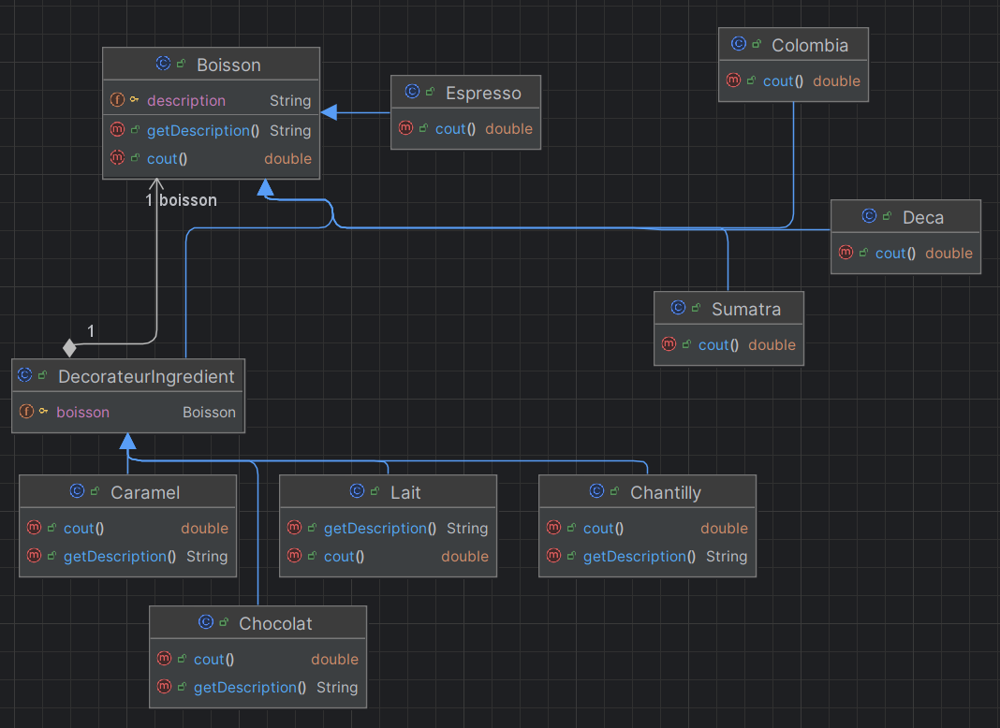

# Système de Boissons avec Design Pattern Décorateur

--- 

## Description
L'objectif est de créer un système permettant de gérer des boissons et d'ajouter des ingrédients de manière dynamique 
en utilisant le **Design Pattern Décorateur**.

## Diagramme de classe

